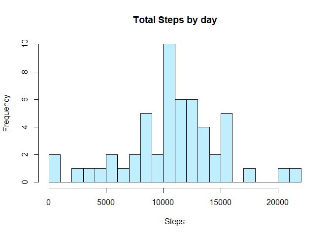
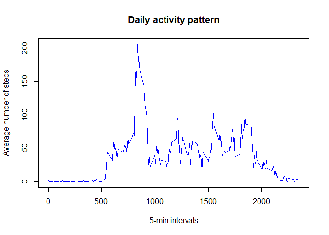
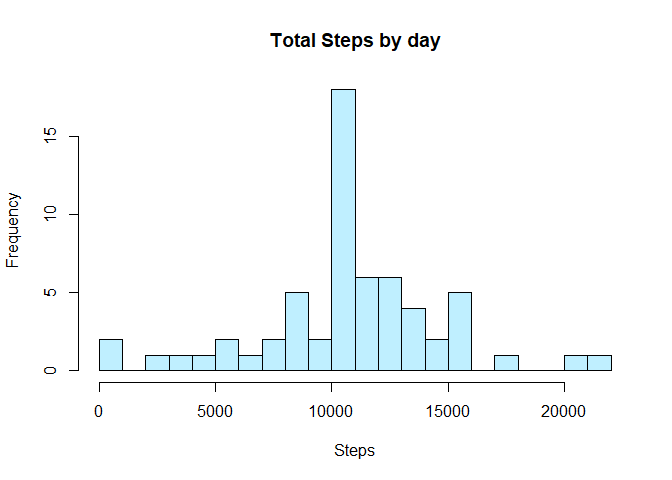
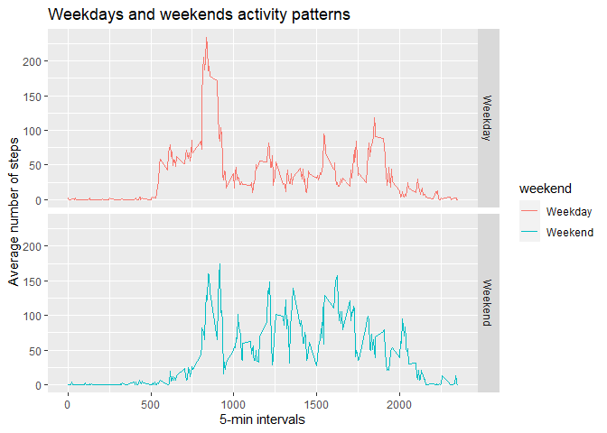

## Main Objective is fullfil this requirements

1. Code for reading in the dataset and/or processing the data
2. Histogram of the total number of steps taken each day
3. Mean and median number of steps taken each day
4. Time series plot of the average number of steps taken
5. The 5-minute interval that, on average, contains the maximum number of steps
6. Code to describe and show a strategy for imputing missing data
7. Histogram of the total number of steps taken each day after missing values are       imputed
8. Panel plot comparing the average number of steps taken per 5-minute interval         across weekdays and weekends
9. All of the R code needed to reproduce the results (numbers, plots, etc.) in the      report

## 1. Code for reading in the dataset and/or processing the data
Downloading file

```r
fileUrl <- "https://d396qusza40orc.cloudfront.net/repdata%2Fdata%2Factivity.zip"
download.file(fileUrl, destfile = "activity.zip", method = "curl")

### Unzip files
if (!file.exists("./NEI_Info"))
{ unzip("activity.zip") }

### Reading Table
Data                <- read.csv("activity.csv")
```

## 2. Histogram of the total number of steps taken each day
Daily steps are calculated using aggregate function

```r
dailysteps          <- aggregate(steps ~ date, Data, sum)
head(dailysteps)
```

```
##         date steps
## 1 2012-10-02   126
## 2 2012-10-03 11352
## 3 2012-10-04 12116
## 4 2012-10-05 13294
## 5 2012-10-06 15420
## 6 2012-10-07 11015
```

```r
hist(dailysteps$steps, col = "lightblue1", main = "Total Steps by day", breaks=20, xlab = "Steps")
```

<!-- -->

## 3. Mean and median number of steps taken each day
Mean and median could be calculated with any of these two methods, we are ignoring missing values in the data set

```r
summary (dailysteps)
```

```
##      date               steps      
##  Length:53          Min.   :   41  
##  Class :character   1st Qu.: 8841  
##  Mode  :character   Median :10765  
##                     Mean   :10766  
##                     3rd Qu.:13294  
##                     Max.   :21194
```

```r
mean(dailysteps$steps)
```

```
## [1] 10766.19
```

```r
median(dailysteps$steps)
```

```
## [1] 10765
```

## 4. Time series plot of the average number of steps taken 

```r
stepsbyinterval    <- aggregate(steps ~ interval, Data, mean)
head(stepsbyinterval)
```

```
##   interval     steps
## 1        0 1.7169811
## 2        5 0.3396226
## 3       10 0.1320755
## 4       15 0.1509434
## 5       20 0.0754717
## 6       25 2.0943396
```

```r
plot(stepsbyinterval$interval, stepsbyinterval$steps, type = "l", col = "blue",
     main = "Daily activity pattern", xlab = "5-min intervals",
     ylab = "Average number of steps")
```

<!-- -->

## 5. The 5-minute interval that, on average, contains the maximum number of steps

```r
stepsbyinterval[which.max(stepsbyinterval$steps), ]
```

```
##     interval    steps
## 104      835 206.1698
```

## 6. Code to describe and show a strategy for imputing missing data
### Imputing missing values
Giving the fact we have at least 8 days with only missing values and I had already calculated mean for 5 min interval, I will use this value to fill the steps missing ones.
Number of missing values could be calculated using summary

```r
summary(Data)
```

```
##      steps            date              interval     
##  Min.   :  0.00   Length:17568       Min.   :   0.0  
##  1st Qu.:  0.00   Class :character   1st Qu.: 588.8  
##  Median :  0.00   Mode  :character   Median :1177.5  
##  Mean   : 37.38                      Mean   :1177.5  
##  3rd Qu.: 12.00                      3rd Qu.:1766.2  
##  Max.   :806.00                      Max.   :2355.0  
##  NA's   :2304
```

```r
names(stepsbyinterval)[2]       <- "Avg.steps"
Data1                           <- merge(Data,stepsbyinterval)
Data1$steps[is.na(Data1$steps)] <- Data1$Avg.steps[is.na(Data1$steps)]
```

## 7. Histogram of the total number of steps taken each day after missing values are       imputed

```r
dailysteps1                     <- aggregate(steps ~ date, Data1, sum)
hist(dailysteps1$steps, col = "lightblue1", main = "Total Steps by day", breaks=20, xlab = "Steps")
```

<!-- -->

### Mean and median number of steps taken each day
Mean and median could be calculated with any of these two methods

```r
summary (dailysteps1)
```

```
##      date               steps      
##  Length:61          Min.   :   41  
##  Class :character   1st Qu.: 9819  
##  Mode  :character   Median :10766  
##                     Mean   :10766  
##                     3rd Qu.:12811  
##                     Max.   :21194
```

```r
mean    (dailysteps1$steps)
```

```
## [1] 10766.19
```

```r
median  (dailysteps1$steps)
```

```
## [1] 10766.19
```

Do these values differ from the estimates from the first part of the assignment? 
Yes the number are different from the ones calculated in the first part, mean still the same.
What is the impact of imputing missing data on the estimates of the total daily number of steps? Median is equal to mean.  Mean still the same.

## Are there differences in activity patterns between weekdays and weekends?
### Creating data frame for weekdays and weekend days.

```r
Data2               <- Data
Data2$date          <- as.Date(Data2$date)
Data2$weekday       <- weekdays(Data2$date)
Data2$weekend       <- ifelse(Data2$weekday=="Saturday" | Data2$weekday=="Sunday",                          "Weekend", "Weekday" )
StepbyInterval2     <- aggregate(steps ~ interval + weekend, data = Data2, mean)
```

## 8. Panel plot comparing the average number of steps taken per 5-minute interval         across weekdays and weekends

```r
library(ggplot2)
```

```
## Warning: package 'ggplot2' was built under R version 4.0.2
```

```r
ggplot(StepbyInterval2, aes(interval, steps, color= weekend)) + geom_line() + facet_grid(weekend ~ .) + ggtitle("Weekdays and weekends activity patterns") +
 xlab("5-min intervals") + ylab("Average number of steps") 
```

<!-- -->

Morning peak is higher on weekdays. Weekends Number of steps higher on average during the day. 
